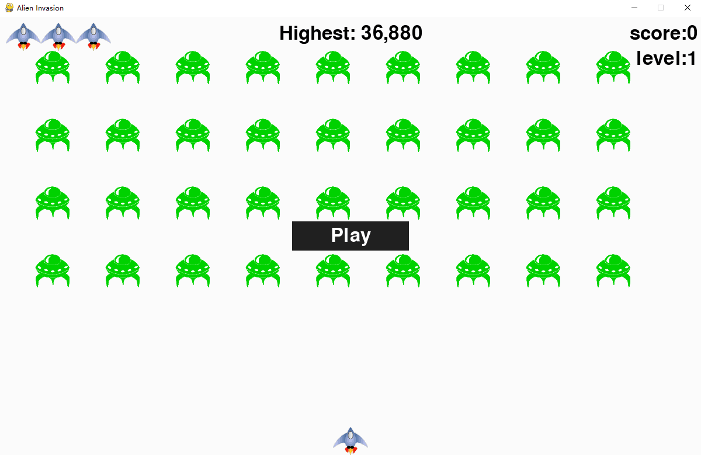

#  The game Alien Invasion :alien: 

[中文](./README.zh.md) | [English](./README.md)

- [Game Description] (#Game Description)
- [Operating Environment] (#Operating Environment)
- [Page Effects] (#Page Effects)
- [Game download] (#Game download)

## Game Description

This is a shooting game. When an alien invades, the rocket shoots out a bullet, and the alien hit by the bullet will disappear.

| Press the key | Feature Description |
| :-------: | ------- |
| ←         | The rocket moves to the left |
| →         | The rocket moves to the right |
| Space     | Rockets fire bullets |
| r         | Restart the game |
| w         | Pause the game |
| c         | Continue the game |
| Esc       | Quit the game |

## Operating Environment
> pygame  
> certifi==2019.11.28  
> chardet==3.0.4  
> idna==2.8  
> soupsieve==1.9.5  
> urllib3==1.25.7  

## Page Effects

## Game download
[Download alien invasion game](https://github.com/babyAnnie/python_game/releases/download/python/alien_invasion.exe)

**Enjoy! ❤**